# Effect of Kubernetes Pod Chaining on Latency

This experiment evaluates how end-to-end packet latency changes as the number of intermediate forwarding pods increases inside a Kubernetes microservice chain. \
The setup emulates a simple L3 forwarding chain using Scapy, running on Minikube with Calico as the CNI.


## Architecture

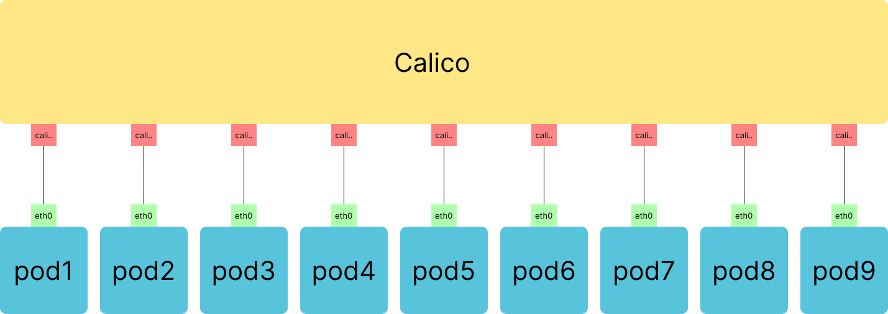

The chain consists of:

```
pod1 → pod2 → pod3 → pod4 → pod5 → pod6 → pod7 → pod8 → pod9
```

- **pod1** injects packets  
- **pod2–pod8** forward packets  
- **pod9** receives packets (sink)

Each forwarding pod listens on `eth0`, reads the packet payload, rebuilds a new Ethernet/IP/TCP frame, and sends it to the next pod using Scapy.


## Forwarding Flow

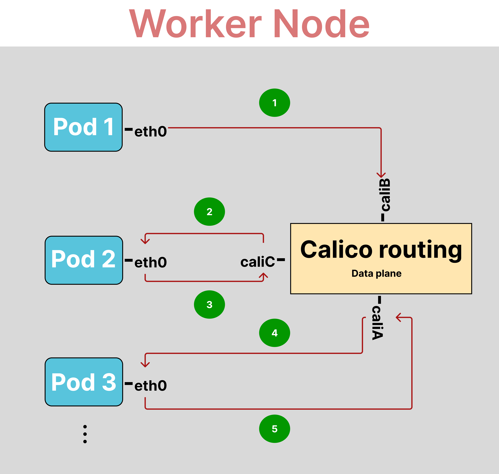


## Experimental Summary

- Cluster: **Minikube** (single node, Ubuntu 22.04, Calico CNI)  
- Each pod uses: **python:3.11-slim**  
- No CPU/memory limits → forwarding performance is user-space dominated  
- Traffic: replayed `.pcap` of 1000 unique-payload packets (at low constant rate avoiding burst packets dropout)
- Capture: `tcpdump` at the head and tail of the chain  


## Run the Experiment

### Start Minikube with Calico
```bash
minikube start -d docker --cni=calico -p networking
```

### Set profile
```bash
minikube profile networking
```

### Deploy pods
```bash
kubectl apply -f deployments/
```

### Check pods status
```bash
kubectl get pods -o wide
```


## Results

### Latency plots per chain length
<div align="center">
  <table>
    <tr>
      <td>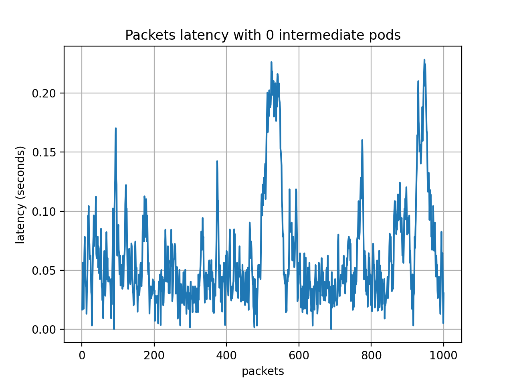</td>
      <td>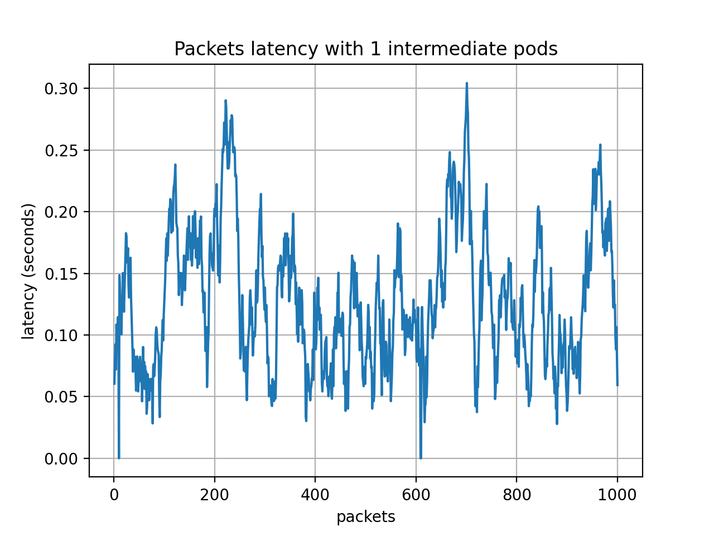</td>
      <td>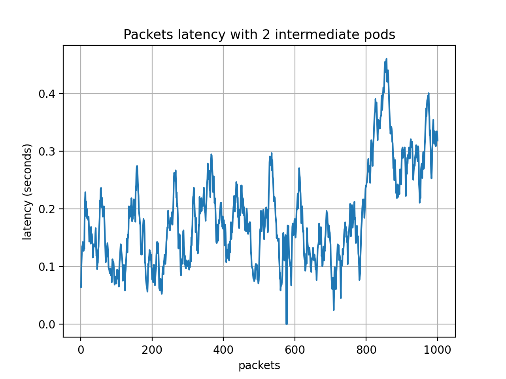</td>
    </tr>
    <tr>
      <td>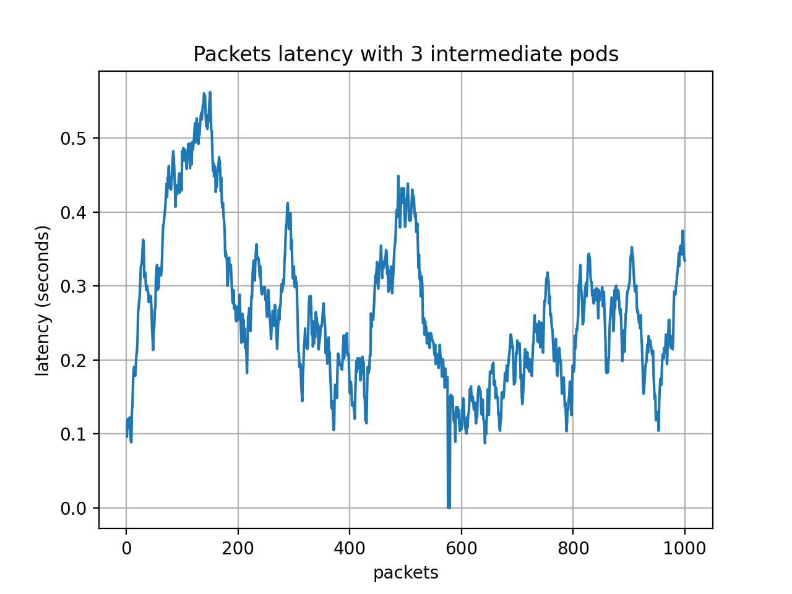</td>
      <td>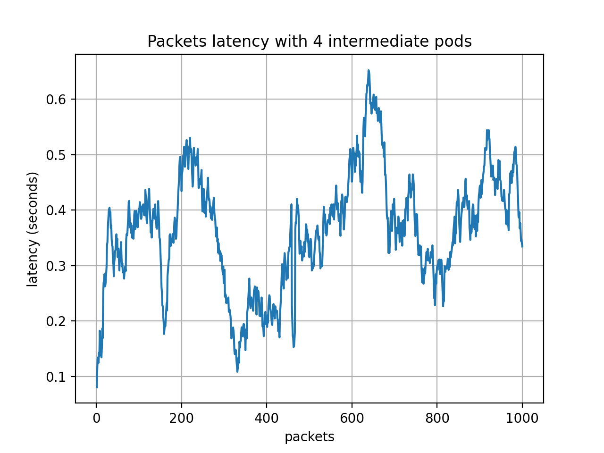</td>
      <td>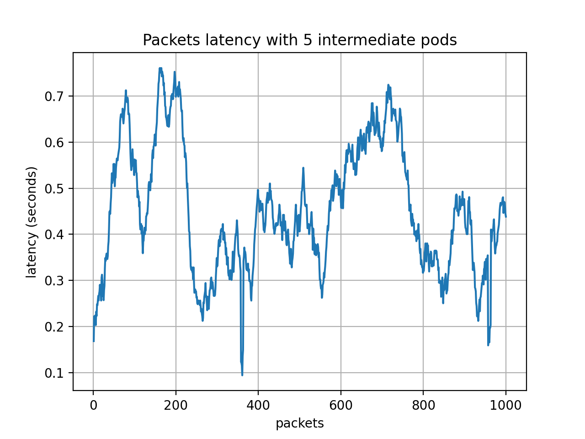</td>
    </tr>
    <tr>
      <td>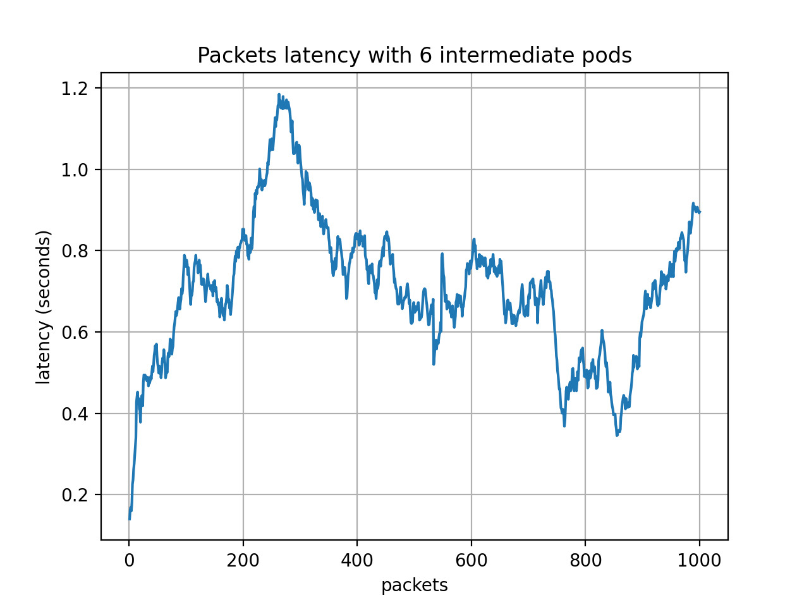</td>
    </tr>
  </table>
</div>


### Latency & percentiles
<div align="center">
  <table>
    <tr>
      <td>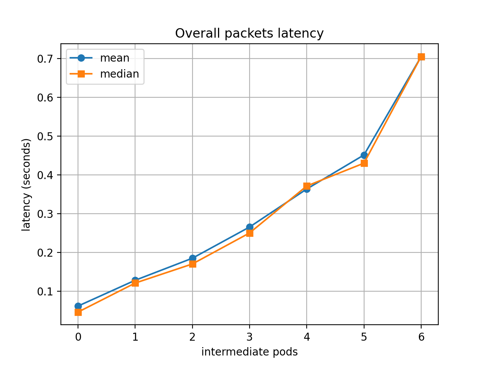</td>
      <td>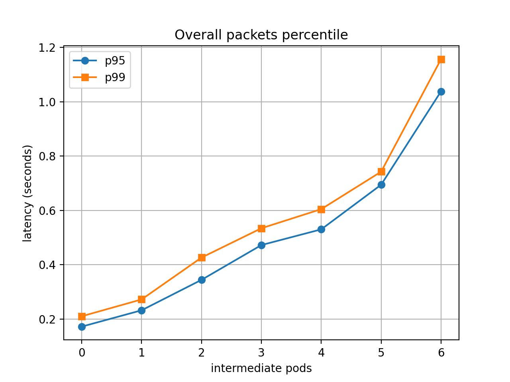</td>
    </tr>
    
  </table>
</div>

## Conclusion
Latency increases with chain depth, nearly linear up to 5 pods, higher deviation at deeper chains (6+ pods)

<!--
# Point Docker CLI to Minikube’s Docker daemon
eval $(minikube docker-env)
# Undo pointing
eval $(minikube docker-env -u)

 
# awk '{print $1}'
# ip route show
ip r


Pod2:
tcpdump -i eth0 -vv -w pod2.pcap 'tcp and dst 10.244.246.130 and dst port 60000'

Pod9:
tcpdump -i eth0 -vv -w pod9.pcap 'tcp and dst 10.244.246.137 and dst port 60000'

Pod1:
tcpreplay -i eth0 --pps=20 src.pcap

-->